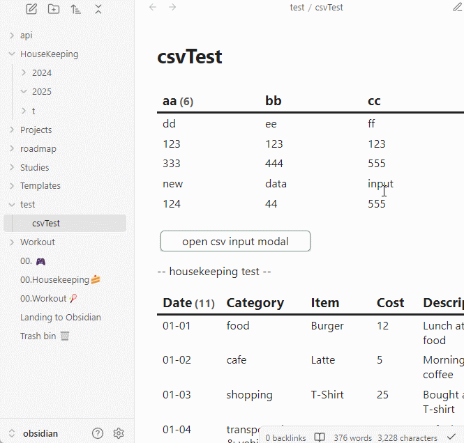
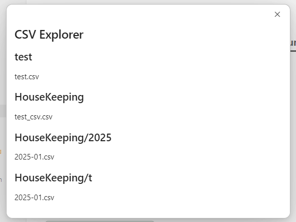
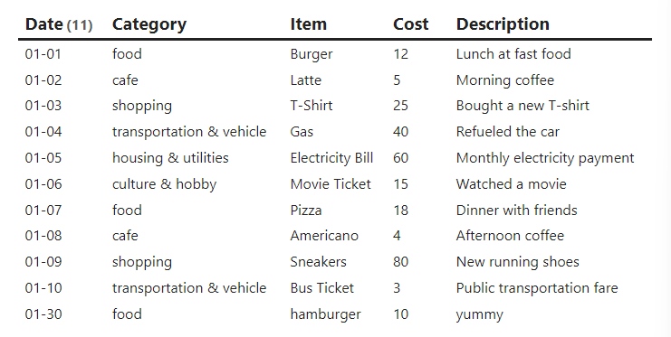

# Obsidian CSV All-in-One

A plugin for handling `.csv` files, including creating, editing, and saving CSV data.

----
## Other Language Docs
- [Korean](./docs/README.kr.md)
- Maybe add more later...

## Brief Notice & Description
> This plugin is designed to work in conjunction with `dataviewjs`.
> Its primary purpose is to create CSV files and add data to them.

----
## Examples
### Using Obsidian Command
#### Creating CSV File

- Press `Ctrl + P` -> Search for 'Create CSV Table'
Enter the required data as shown below and click Submit.


#### Search CSV Files
- UI is subject to updates.
- Press `Ctrl + P` -> Search for 'Open CSV Explorer'
- Move or delete CSV files.



### Using dataviewjs

#### - View as Table
- Source Code
```dataviewjs
const csvPlugin = app.plugins.plugins['csv-allinone'];
const fileName = "HouseKeeping/t/2025-01.csv"; 

csvPlugin.readCSV(app, fileName).then(res => {
	const headers = res.headers.map(item => item[0]);
	dv.table(headers, res.rows);
})
```
- Output


#### - Add New Data (Row)
> Requires the `buttons` plugin.
- Source Code
```dataviewjs
const csvPlugin = app.plugins.plugins['csv-allinone'];
const { createButton } = app.plugins.plugins["buttons"];

const fileName = "HouseKeeping/t/2025-01.csv"; 

const openCsvModal = async(app, headers, f) => {
	 csvPlugin.openCsvInputModal(app, headers, f)
}

csvPlugin.readCSV(app, fileName).then(res => {
	const headers = res.headers.map(item => item[0]);
	dv.span(
	    createButton({
			app, el: this.container, 
			args: { name: "open row input Modal", class: "" },
			clickOverride: {
				click: openCsvModal, params: [app, res.headers, fileName]
			}
		})
	)
})
```
- Output


#### - Add New Column
#### - Delete Existing Column

### Using Templater
- I don’t use Templater, so I’m not familiar with it. Sorry!

----
## Usage/Features

----
## APIs
### Handle Files
- `readCSV`
	- Parameters: `(app: App, fileName: string)`
	- Returns: `Promise<CSVTable | null>`
	> Reads the specified `fileName` and returns a `CSVTable`.

- `saveCSV`
	- Parameters: `(app: App, fileName: string, table: CSVTable)`
	- Returns: `void`
	> Saves the given `CSVTable` data to the specified `fileName`.

### CSVTable (Class)
- Functions available in the class will be documented here.

## How It Works
When you create a CSV file using this plugin, two files are generated: `.csv` and `.csv.meta`.

If you load an existing CSV file, a `.csv.meta` file will be generated automatically.

The `.csv` file contains basic table data, while the `.meta` file stores metadata about the columns, such as their attributes. In the current version (`v0.1.0`), the `.meta` file only stores the type of each column, but future updates will include features like data/select values, validity constraints, and more.

## Contributing
Any form of contribution is welcome.

## License
- MIT
