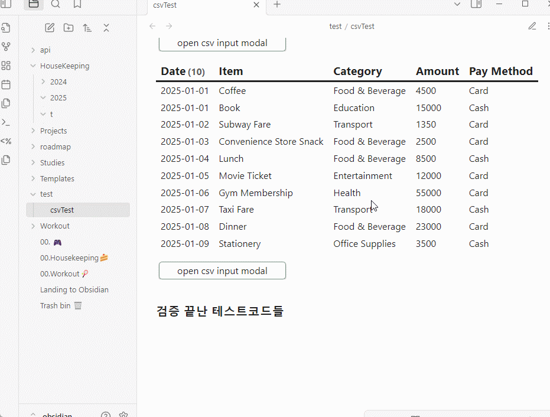

# CSV All-in-One
> .csv 파일을 생성하고, 내부의 데이터를 수정하고 저장하는 등 CSV 관련된 작업을 처리하기 위한 플러그인입니다.
----
## Other Language Docs
-[english](../README.md)
-maybe add later...

## Brief Notice & Description
> 이 플러그인은 dataviewjs를 사용하는 것을 전제로 만들어졌습니다.
> CSV 파일을 만들고 데이터를 추가하는것을 주 목적으로 제작되었습니다.

----
## Examples
### with obsidian command
#### Creating CSV File

- Ctrl + P -> 'Create CSV Table' 검색
아래처럼 필요한 데이터를 입력 후 Submit


#### Search CSV Files
- UI 수정 예정
- Ctrl + P -> 'Open CSV Explorer' 검색
- CSV 파일의 위치 이동, 삭제가 가능.


### with dataviewjs

#### - view as table
- 소스코드
```javascript
const CSVPlugin = app.plugins.plugins['CSV-allinone'];

const fileName = "HouseKeeping/t/2025-01.csv"; 

CSVPlugin.readCSV(app, fileName).then(res => {
	let headers = []
	let defaultValues = {}
	for(const [key, value] of Object.entries(res.headers)) {
		headers.push(key)
		defaultValues[key] = ""
	}
	const columnLength = headers.length;

	let rows = []
	for(const row of res.rows) {
		const newRow = [row[0].slice(5), ...row.slice(1)]
		rows.push(newRow);
	}
	dv.table(headers, rows);
})
```
- 결과물


#### - add new data (row)
> buttons 플러그인을 사용합니다.
- 기능 설명
	- 특정 CSV 파일에 row를 추가합니다.
	- 이미 읽힌 상태의 데이터를 가공하지 않습니다. 실시간 업데이트가 필요하다면, 별도로 파일 업데이트를 await하여 다시 파일을 읽어야합니다.
	- defaultValue를 입력할 수 있습니다.

- 소스코드
```javascript
const CSVPlugin = app.plugins.plugins['CSV-allinone'];
const { createButton } = app.plugins.plugins["buttons"];

const fileName = "HouseKeeping/t/2025-01.csv"; 
const openCSVAppendModal = async(app, headers, f, defaults) => {
	 CSVPlugin.openCSVInputModal(app, headers, f, defaults)
}

CSVPlugin.readCSV(app, fileName).then(res => {
	let headers = []
	let defaultValues = {}
	for(const [key, value] of Object.entries(res.headers)) {
		headers.push(key)
		defaultValues[key] = ""
	}
	const columnLength = headers.length;

	let rows = []
	for(const row of res.rows) {
		const newRow = [row[0].slice(5), ...row.slice(1)]
		rows.push(newRow);
	}

	dv.table(headers, rows);
	// default values
	defaultValues['Date'] = moment(Date.now()).format('YYYY-MM-DD');
	defaultValues['Category'] = res.headers['Category'].options[0];
	defaultValues['Description'] = '-';

	dv.span(
	    createButton({
			app, el: this.container, 
			args: {
				name: "open CSV input modal",
				class: ""
			},
			clickOverride: {
				click: openCSVAppendModal, 
				params: [app, res.headers, fileName, defaultValues]
			}
		})
	)
})
```
- 결과물


#### - add new column
#### - delete exist column


### with templater
- 제가 템플레이터를 안써서 잘 모르겠습니다. 머쓱.

----
## Usage/Features

----
## APIs
### Handle file
- readCSV
	- parameters (app: App, fileName: string)
	- return Promise<CSVTable | null>
	> filename을 입력받아서 CSVTable을 반환해줍니다.

- saveCSV
	- parameters (app: App, fileName, string, table: SCVTable)
	- return void
	> CSVtable 정보를 받아서 저장합니다.

### CSVTable (class)
-- class에서 할 수 있는 함수들 작성해둘 것.

#### Header (type)

#### CSVRow (type)

#### CSVCellType(type)


## How it work
이 플러그인을 이용하여 CSV 파일을 생성하면, .csv, .csv.meta의 두 파일을 생성하게 됩니다.
원래 존재하던 CSV파일을 불러오는 경우에는 임의로 .csv.meta 파일을 생성합니다.

CSV에는 기본적인 테이블 정보들이, meta 파일에는 CSV의 각 column 속성에 대한 정보가 담깁니다.
현재(v0.1.0)는 .meta파일에 각 column의 type여부만 저장하지만, 후에는 data/select값 등이 추가되거나, 유효치 지정 등이 들어갈 예정입니다.

## Contributing
아무렇게나 기여해 주셔도 감사합니다.


## license
- MIT